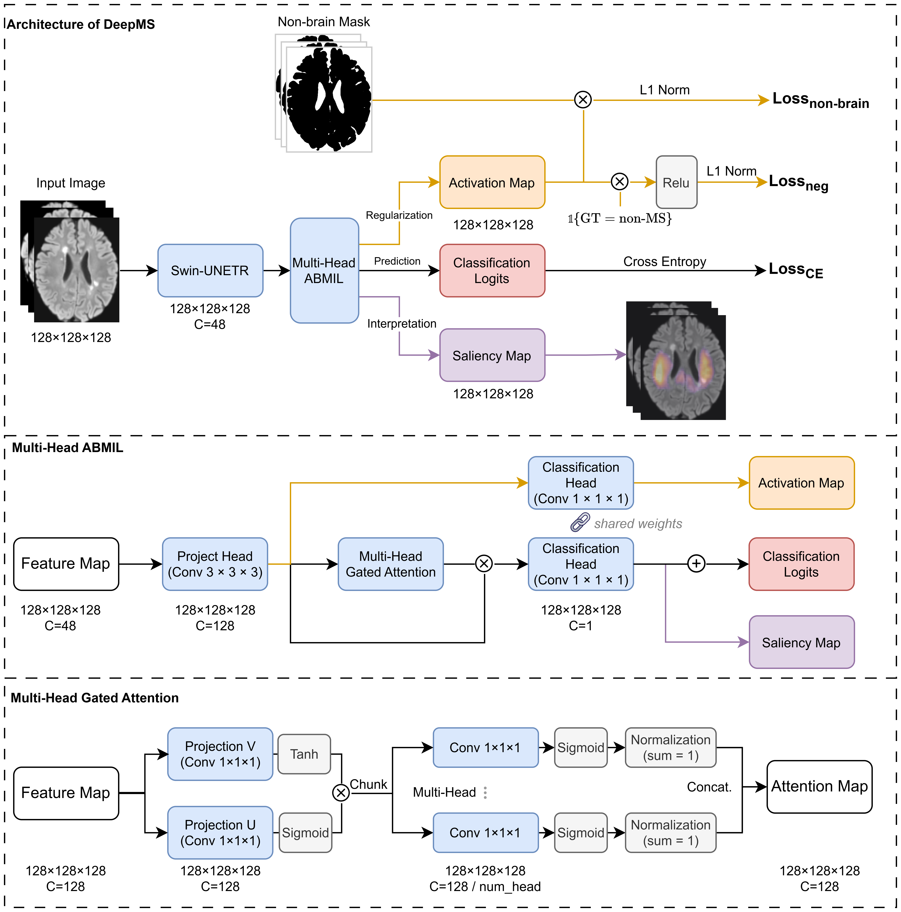

<div align="center">

# Predicting Multiple Sclerosis with Multimodal Deep Learning Integrating Lesion and Normal-Appearing White Matter Information


[](https://www.rsna.org/research/research-awards/kuo-york-chynn-neuro-research-award)
[](LICENSE)

<h3>🏆 Winner of the Kuo York Chynn Neuroradiology Research Award at RSNA 2025 🏆</h3>

[**Paper (Coming Soon)**](#) | [**BibTeX**](#citation)

</div>

---

## 📅 Open Source Roadmap

We are actively preparing the code and data protocols for public release. We are committed to making the repository fully functional **no later than December 19, 2025**.

- [ ] **Pre-print Release** (Expected: Dec 2025)
- [ ] **Preprocessing Pipeline** (Target: Dec 15, 2025)
- [ ] **Model Architecture & Training Code** (Target: Dec 15, 2025)
- [ ] **Validation & Inference Code** (Target: Dec 19, 2025)

> 🌟 **Star this repository** to receive immediate notifications upon release!

---

## 🧩 Study Design

Our study try to integrate both focal lesions and abnormalities in normal-appearing white matter (NAWM) to improve MS prediction with routine sMRI.


*(Figure 1: Overview of the study design and data flow.)*

---

## 🏗️ Model Architecture

The DeepMS framework utilizes a novel deep learning architecture designed for robust MS prediction and interpretation.


*(Figure 2: Detailed architecture of the DeepMS model.)*

---

## 📊 External Datasets (updating)

To ensure robustness, we use additional ADNI data for training and evaluated DeepMS on 15 other external cohorts.

### 1. Multiple Sclerosis Datasets

| Dataset | Subjects ($N$) | Diagnosis | Source / Access |
| :--- | :---: | :--- | :--- |
| **QSM** | 150 | MS (100) / HC (50) | [Univ. of Bologna](https://zenodo.org/records/10931121) |
| **MSSEG-2016** | 53 | MS | [Inria / MSSEG](https://portal.fli-iam.irisa.fr/msseg-challenge/overview) |
| **Open MS Data** | 50 | MS | [Univ. of Ljubljana](https://github.com/muschellij2/open_ms_data) |
| **MSSEG-2** | 40 | MS | [Inria / MSSEG-2](https://portal.fli-iam.irisa.fr/msseg-2/data/) |
| **MS-ISBI** | 19 | MS | [JHU / IACL](https://smart-stats-tools.org/lesion-challenge) |
| **PediMS** | 9 | Pediatric MS | [Babeș-Bolyai Univ.](https://github.com/DanieleStefano/PediMS-dataset) |

### 2. Non-MS Datasets (Generalizability & Specificity)

We included datasets with other neurological conditions (e.g., Alzheimer's, Stroke, Tumor, Epilepsy) to test the model's specificity and performance on unseen pathologies.

| Dataset | Subjects ($N$) | Diagnosis | Source / Access |
| :--- | :---: | :--- | :--- |
| **ADNI (Train only)** | 1,822 | MCI / AD / NC | [ADNI](http://adni.loni.usc.edu/data-samples/data-types/) |
| **UCSF-PDGM** | 501 | Primary Tumor | [TCIA](https://www.cancerimagingarchive.net/collection/ucsf-pdgm/) |
| **ISLES-2022** | 250 | Stroke (CVD) | [TU Munich](https://isles22.grand-challenge.org/) |
| **WMH** | 170 | WM Lesions | [WMH Challenge](https://wmh.isi.uu.nl/) |
| **OpenNeuro-epilepsy** | 170 | Epilepsy / HC | [OpenNeuro (ds004199)](https://openneuro.org/datasets/ds004199) |
| **MPI-Leipzig** | 117 | Aged Healthy Control | [OpenNeuro (ds000221)](https://openneuro.org/datasets/ds000221) |
| **MrBrainS18** | 30 | WM Lesions | [UMC Utrecht](https://mrbrains18.isi.uu.nl/) |

> **Note:** Access to some datasets (e.g., ADNI, MSSEG-2016, MSSEG-2) requires registration and data usage agreement approvals from the respective hosting institutions.

---

## 🛠️ Acknowledgements

We thank the authors of the following repositories for their open-source contributions, which were instrumental in this research:

* **dMRI Preprocessing & Quantitative Maps:**
    * [NYU-DiffusionMRI/DESIGNER-v2](https://github.com/NYU-DiffusionMRI/DESIGNER-v2): Diffusion parameter EStImation with Gibbs and NoisE Removal pipeline Version 2.
* **Pre-trained Models:**
    * [Luffy03/Large-Scale-Medical](https://github.com/Luffy03/Large-Scale-Medical): [TPAMI 2025] Large-Scale 3D Medical Image Pre-training with Geometric Context Priors.

---

## 📝 Citation

If you find this work helpful for your research, please cite our paper (BibTeX entry coming soon):

```bibtex
@article{DeepMS2025,
  title={Predicting Multiple Sclerosis with Multimodal Deep Learning Integrating Lesion and Normal-Appearing White Matter Information},
  author={Your Name and Collaborators},
  journal={Coming Soon},
  year={2025}
}
