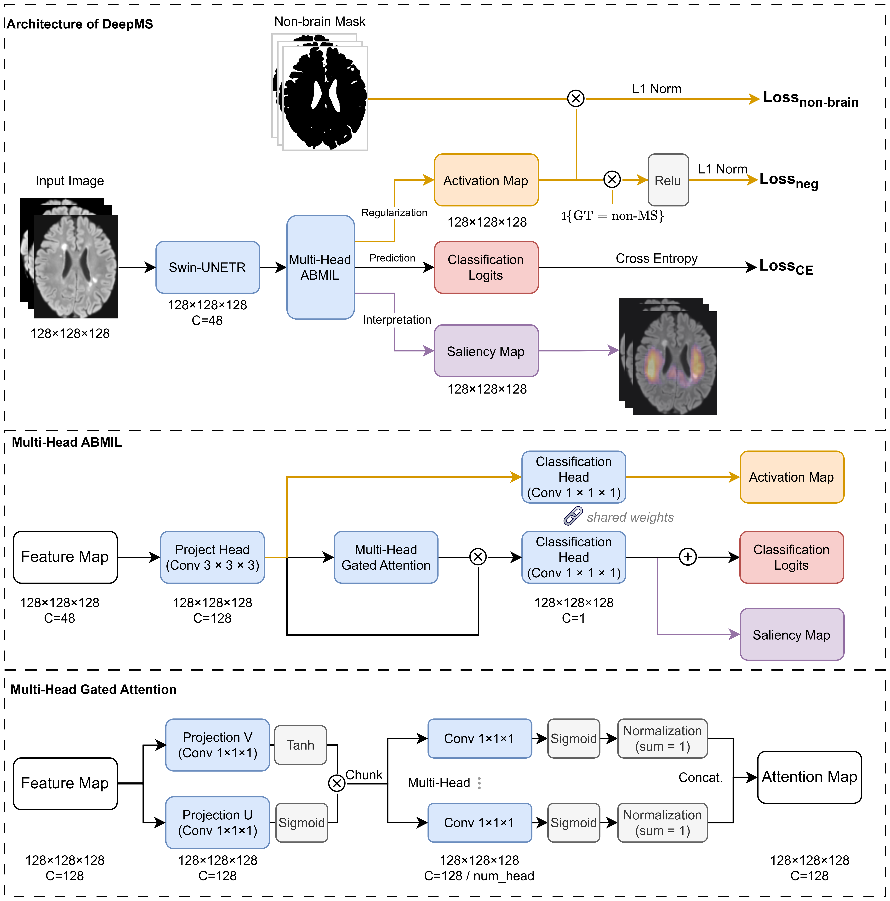
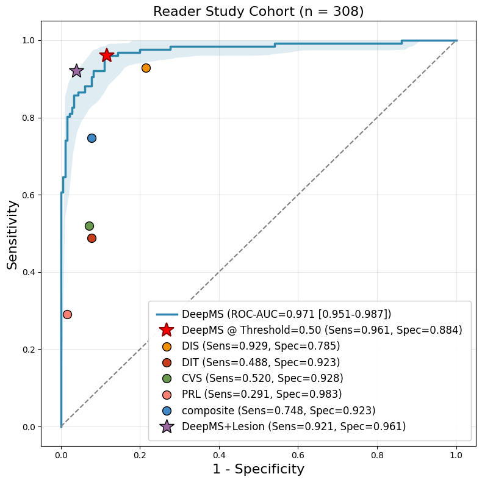

<div align="center">

# Diagnosis of Multiple Sclerosis Using Multimodal Deep Learning Integrating Lesion and Normal-Appearing White Matter: A Retrospective Study with International Multicentre External Validation

[](https://www.rsna.org/research/research-awards/kuo-york-chynn-neuro-research-award)
[](LICENSE)

<h3>🏆 Winner of the Kuo York Chynn Neuroradiology Research Award at RSNA 2025</h3>

[**Manuscript**](https://www.medrxiv.org/content/10.64898/2026.03.04.26347460v1) • [**Citation**](#citation)

</div>

---

## Overview

Current diagnostic criteria for multiple sclerosis (MS) rely heavily on visible white matter lesions (WMLs), which are often non-specific and can also be observed in many MS mimics. DeepMS is a multimodal deep learning framework designed to improve diagnostic specificity by integrating lesion-related signals with abnormalities in normal-appearing white matter (NAWM).

The model is trained using paired diffusion MRI (dMRI) and structural MRI (sMRI), but is designed to operate on routine structural MRI alone at deployment. This enables DeepMS to extract diagnostically useful NAWM-related information without requiring quantitative MRI in real-world clinical workflows.

Our study includes large-scale model development, multireader comparison with established 2024 McDonald biomarkers, lesion-masking analyses, and international multicentre external validation across diverse public datasets and an independent clinical cohort.

---

## Key Highlights

- **Routine MRI deployment**: trained with multimodal MRI, deployed using routine structural MRI alone
- **Lesion + NAWM integration**: captures both focal lesion burden and latent NAWM-related diagnostic signals
- **Strong generalizability**: validated on an independent Krakow cohort and 15 public external datasets
- **Lesion-masking robustness**: retains diagnostic performance after removal of visible white matter lesions
- **Clinical relevance**: compared against established biomarkers including DIS, DIT, CVS, and PRL in a multireader study

---

## Project Status

We are actively preparing the codebase and release materials for public dissemination.

- [x] Manuscript available on medRxiv
- [x] External public datasets documented
- [x] Preprocessing pipeline
- [x] Model architecture and training framework
- [x] Validation and inference workflow
- [ ] Environment setup and bash scripts (coming soon)

---

## Study Design

Our study aims to improve MS diagnosis from routine MRI by integrating both visible white matter lesions and latent abnormalities in normal-appearing white matter.


*Figure 1. Overview of the study design, development pipeline, validation strategy, and multimodal learning framework.*

---

## Model Architecture

DeepMS uses a multimodal deep learning architecture designed to learn NAWM-related diagnostic signatures from paired dMRI and sMRI during training, while remaining deployable on routine sMRI alone.



*Figure 2. Schematic overview of the DeepMS model architecture.*

---

## Results Snapshot

DeepMS demonstrated robust performance across internal and external evaluations:

- **Internal test cohort**: AUC 0.968
- **Independent Krakow cohort**: AUC 0.940
- **Public multi-site external cohort**: AUC 0.974
- **Lesion-masking analysis**: substantial diagnostic signal retained after all WMLs removal (AUC 0.974)
- **Multireader study**: outperformed established lesion-based biomarkers



*Figure 3. Comparison with established lesion-based biomarkers in reader study.*

These findings support the presence of diagnostically meaningful NAWM-related information in routine structural MRI.

---

## External Datasets

To improve robustness and assess generalizability, we incorporated additional ADNI data during development and evaluated DeepMS across 15 public external datasets spanning both MS and non-MS conditions.

### Multiple Sclerosis Datasets

| Dataset | Subjects (N) | Diagnosis | Source / Access |
| :--- | :---: | :--- | :--- |
| **QSM** | 150 | MS (100) / HC (50) | [Univ. of Bologna](https://zenodo.org/records/10931121) |
| **MSSEG-2016** | 53 | MS | [Inria / MSSEG](https://portal.fli-iam.irisa.fr/msseg-challenge/overview) |
| **Open MS Data** | 50 | MS | [Univ. of Ljubljana](https://github.com/muschellij2/open_ms_data) |
| **MSSEG-2** | 40 | MS | [Inria / MSSEG-2](https://portal.fli-iam.irisa.fr/msseg-2/data/) |
| **MS-ISBI** | 19 | MS | [JHU / IACL](https://smart-stats-tools.org/lesion-challenge) |
| **PediMS** | 9 | Pediatric MS | [Babeș-Bolyai Univ.](https://github.com/DanieleStefano/PediMS-dataset) |

### Non-MS Datasets

To evaluate specificity and out-of-distribution robustness, we included datasets covering other neurological conditions such as Alzheimer's disease, stroke, tumor, epilepsy, white matter lesion burden, and non-MS demyelination.

| Dataset | Subjects (N) | Diagnosis | Source / Access |
| :--- | :---: | :--- | :--- |
| **ADNI (Train only)** | 1,822 | MCI / AD / NC | [ADNI](http://adni.loni.usc.edu/data-samples/data-types/) |
| **UCSF-PDGM** | 501 | Primary Tumor | [TCIA](https://www.cancerimagingarchive.net/collection/ucsf-pdgm/) |
| **ISLES-2022** | 250 | Stroke (CVD) | [TU Munich](https://isles22.grand-challenge.org/) |
| **MetsToBrain** | 200 | Metastasis Tumor | [TCIA](https://www.cancerimagingarchive.net/collection/pretreat-metstobrain-masks/) |
| **WMH** | 170 | White Matter Lesions | [WMH Challenge](https://wmh.isi.uu.nl/) |
| **OpenNeuro-epilepsy** | 170 | Epilepsy / HC | [OpenNeuro (ds004199)](https://openneuro.org/datasets/ds004199) |
| **MPI-Leipzig** | 117 | Aged Healthy Control | [OpenNeuro (ds000221)](https://openneuro.org/datasets/ds000221) |
| **MrBrainS18** | 30 | White Matter Lesions | [UMC Utrecht](https://mrbrains18.isi.uu.nl/) |
| **PediDemi** | 13 | Non-MS demyelination | [figshare](https://doi.org/10.6084/m9.figshare.28694435) |

> **Note:** Access to some datasets may require registration, approval, or data use agreements from the original hosting institutions.

---

## Code and Data Availability

The source code for structural MRI preprocessing, model development, training, validation, and inference is publicly available in this repository.

Links and identifiers for all public external datasets used in this study are provided above and in the manuscript.

Internal clinical datasets and trained model weights are not publicly available because of patient privacy protections, institutional regulations, and hospital data governance policies. De-identified access to internal data may be considered upon reasonable request, subject to institutional review, regulatory approval, and execution of any required data use agreements.


---

## Getting Started

Step-by-step documentation for environment setup, data preparation, training, and evaluation will be coming soon!

---

## Acknowledgements

We thank the authors of the following repositories for their open-source contributions, which were instrumental to this research:

- **dMRI Preprocessing & Quantitative Maps:** [NYU-DiffusionMRI/DESIGNER-v2](https://github.com/NYU-DiffusionMRI/DESIGNER-v2)
- **Pre-trained Models:** [Luffy03/Large-Scale-Medical](https://github.com/Luffy03/Large-Scale-Medical)

---

## Citation

If you find this work helpful for your research, please cite our manuscript:

```bibtex
@article{Ma2026.03.04.26347460,
  author = {Ma, Jiajian and Stepanov, Valentin and Rui, Wushuang and Chen, Hsuan-Chih and Lis, Maciej and Stanek, Aleksandra and Puto, Tomasz and Lan, Michael and Chen, Jenny and Liu, Timothy and Patel, Roshni and Breen, Matthew and Lee, Matthew and Eikermann-Haerter, Katharina and Shepherd, Timothy M. and Novikov, Dmitry S. and O'Neill, Kimberly A. and Fieremans, Els and Shen, Yiqiu},
  title = {Diagnosis of Multiple Sclerosis Using Multimodal Deep Learning Integrating Lesion and Normal-Appearing White Matter: A Retrospective Study with International Multicentre External Validation},
  elocation-id = {2026.03.04.26347460},
  year = {2026},
  doi = {10.64898/2026.03.04.26347460},
  publisher = {Cold Spring Harbor Laboratory Press},
  journal = {medRxiv},
  url = {https://www.medrxiv.org/content/10.64898/2026.03.04.26347460v1}
}