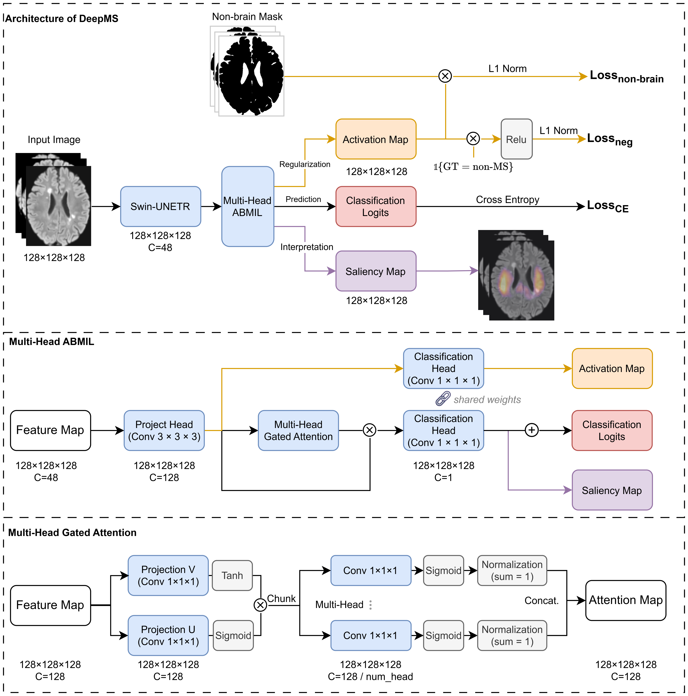
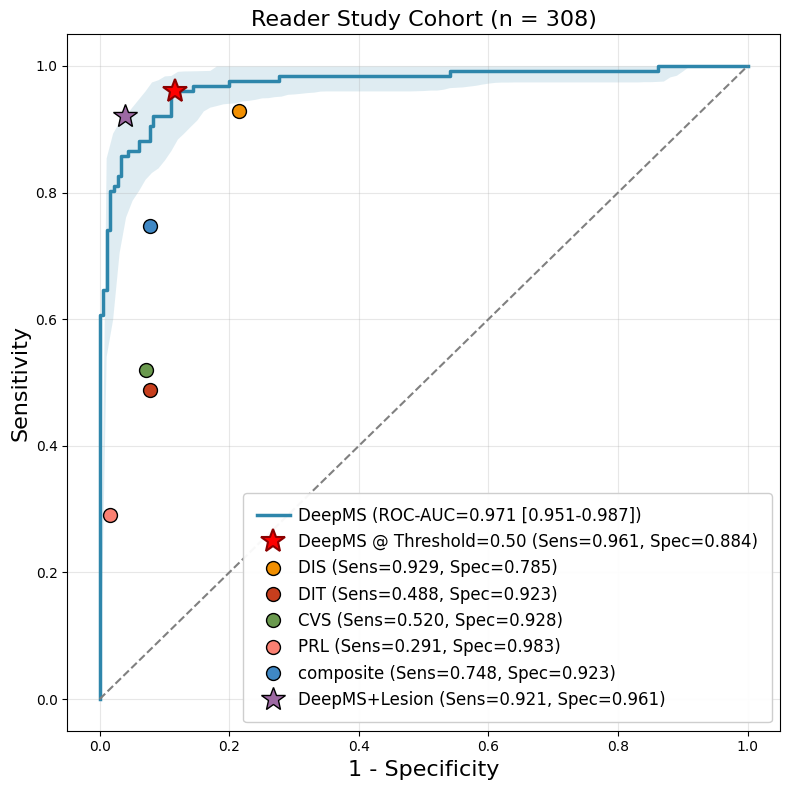

<div align="center">

# Diagnosis of Multiple Sclerosis Using Multimodal Deep Learning Integrating Lesion and Normal-Appearing White Matter

[](https://www.rsna.org/research/research-awards/kuo-york-chynn-neuro-research-award)
[](LICENSE)

<h3>🏆 Winner of the Kuo York Chynn Neuroradiology Research Award at RSNA 2025</h3>

[**Manuscript**](https://www.medrxiv.org/content/10.64898/2026.03.04.26347460v1) • [**Citation**](#citation)

</div>

---

## Overview

Current diagnostic criteria for multiple sclerosis (MS) rely heavily on visible white matter lesions (WMLs), which are often non-specific and can also be observed in many MS mimics. DeepMS is a multimodal deep learning framework designed to improve diagnostic specificity by integrating lesion-related signals with abnormalities in normal-appearing white matter (NAWM).

The model is trained using paired diffusion MRI (dMRI) and structural MRI (sMRI), but is designed to operate on routine structural MRI alone at deployment. This enables DeepMS to extract diagnostically useful NAWM-related information without requiring quantitative MRI in real-world clinical workflows.

Our study includes large-scale model development, multireader comparison with established 2024 McDonald biomarkers, lesion-masking analyses, and international multicentre external validation across diverse public datasets and an independent clinical cohort.

---

## Key Highlights

- **Routine MRI deployment**: trained with multimodal MRI, deployed using routine structural MRI alone
- **Lesion + NAWM integration**: captures both focal lesion burden and latent NAWM-related diagnostic signals
- **Strong generalizability**: validated on an independent Krakow cohort and 15 public external datasets
- **Lesion-masking robustness**: retains diagnostic performance after removal of visible white matter lesions
- **Clinical relevance**: compared against established biomarkers including DIS, DIT, CVS, and PRL

---

## Project Status

We are actively preparing the codebase and release materials for public dissemination.

- [x] Manuscript available on medRxiv
- [x] External public datasets documented
- [x] Preprocessing pipeline
- [x] Model architecture and training framework
- [x] Validation and inference workflow
- [x] Reproducible uv environment and Slurm training/inference jobs

---

## Study Design

Our study aims to improve MS diagnosis from routine MRI by integrating both visible white matter lesions and latent abnormalities in normal-appearing white matter.


*Figure 1. Overview of the study design, development pipeline, validation strategy, and multimodal learning framework.*

---

## Model Architecture

DeepMS uses a multimodal deep learning architecture designed to learn NAWM-related diagnostic signatures from paired dMRI and sMRI during training, while remaining deployable on routine sMRI alone.



*Figure 2. Schematic overview of the DeepMS model architecture.*

---

## Results Snapshot

DeepMS demonstrated robust performance across internal and external evaluations:

- **Internal test cohort**: AUC 0.968
- **Independent Krakow cohort**: AUC 0.940
- **Public multi-site external cohort**: AUC 0.974
- **Lesion-masking analysis**: substantial diagnostic signal retained after all WMLs removal (AUC 0.974)
- **Multireader study**: outperformed established lesion-based biomarkers



*Figure 3. Comparison with established lesion-based biomarkers in reader study.*

These findings support the presence of diagnostically meaningful NAWM-related information in routine structural MRI.

---

## External Datasets

To improve robustness and assess generalizability, we incorporated additional ADNI data during development and evaluated DeepMS across 15 public external datasets spanning both MS and non-MS conditions.

### Multiple Sclerosis Datasets

| Dataset | Subjects (N) | Diagnosis | Source / Access |
| :--- | :---: | :--- | :--- |
| **QSM** | 150 | MS (100) / HC (50) | [Univ. of Bologna](https://zenodo.org/records/10931121) |
| **MSSEG-2016** | 53 | MS | [Inria / MSSEG](https://portal.fli-iam.irisa.fr/msseg-challenge/overview) |
| **Open MS Data** | 50 | MS | [Univ. of Ljubljana](https://github.com/muschellij2/open_ms_data) |
| **MSSEG-2** | 40 | MS | [Inria / MSSEG-2](https://portal.fli-iam.irisa.fr/msseg-2/data/) |
| **MS-ISBI** | 19 | MS | [JHU / IACL](https://smart-stats-tools.org/lesion-challenge) |
| **PediMS** | 9 | Pediatric MS | [Babeș-Bolyai Univ.](https://github.com/DanieleStefano/PediMS-dataset) |

### Non-MS Datasets

To evaluate specificity and out-of-distribution robustness, we included datasets covering other neurological conditions such as Alzheimer's disease, stroke, tumor, epilepsy, white matter lesion burden, and non-MS demyelination.

| Dataset | Subjects (N) | Diagnosis | Source / Access |
| :--- | :---: | :--- | :--- |
| **ADNI (Train only)** | 1,822 | MCI / AD / NC | [ADNI](http://adni.loni.usc.edu/data-samples/data-types/) |
| **UCSF-PDGM** | 501 | Primary Tumor | [TCIA](https://www.cancerimagingarchive.net/collection/ucsf-pdgm/) |
| **ISLES-2022** | 250 | Stroke (CVD) | [TU Munich](https://isles22.grand-challenge.org/) |
| **MetsToBrain** | 200 | Metastasis Tumor | [TCIA](https://www.cancerimagingarchive.net/collection/pretreat-metstobrain-masks/) |
| **WMH** | 170 | White Matter Lesions | [WMH Challenge](https://wmh.isi.uu.nl/) |
| **OpenNeuro-epilepsy** | 170 | Epilepsy / HC | [OpenNeuro (ds004199)](https://openneuro.org/datasets/ds004199) |
| **MPI-Leipzig** | 117 | Aged Healthy Control | [OpenNeuro (ds000221)](https://openneuro.org/datasets/ds000221) |
| **MrBrainS18** | 30 | White Matter Lesions | [UMC Utrecht](https://mrbrains18.isi.uu.nl/) |
| **PediDemi** | 13 | Non-MS demyelination | [figshare](https://doi.org/10.6084/m9.figshare.28694435) |

> **Note:** Access to some datasets may require registration, approval, or data use agreements from the original hosting institutions.

---

## Code and Data Availability

The source code for structural MRI preprocessing, model development, training, validation, and inference is publicly available in this repository.

Links and identifiers for all public external datasets used in this study are provided above and in the manuscript.

Internal clinical datasets and trained model weights are not publicly available because of patient privacy protections, institutional regulations, and hospital data governance policies. De-identified access to internal data may be considered upon reasonable request, subject to institutional review, regulatory approval, and execution of any required data use agreements.


---

## Repository Layout

```text
DeepMS/
├── configs/accelerate/       # Reproducible multi-GPU training configuration
├── docs/                     # Data and metadata contracts
├── model/                    # Model architectures
├── preprocessing/            # Structural and diffusion MRI preprocessing
├── scripts/slurm/            # Training and explicit inference-profile jobs
├── tests/                    # Unit tests and a two-process validation smoke test
├── utils/                    # Dataset, schedule, aggregation, and reporting
├── infer.py                  # Single-GPU inference entry point
├── report_predictions.py     # Rebuild reports from saved scan predictions
├── train.py                  # Training entry point
├── pyproject.toml            # Direct and optional dependencies
└── uv.lock                   # Fully resolved Linux x86_64 environment
```

## Getting Started

### Requirements

- Linux x86_64
- an NVIDIA driver compatible with the locked PyTorch 2.6.0 / CUDA 12.4 build
- [uv](https://docs.astral.sh/uv/)
- Slurm for the provided cluster jobs

Clone the repository and create the core training/inference environment:

```bash
git clone https://github.com/nyu-shenlab/DeepMS.git
cd DeepMS
curl -LsSf https://astral.sh/uv/install.sh | sh
# Start a new shell if `uv` is not immediately available on PATH.
uv sync --locked --no-dev
./scripts/bootstrap_env.sh --check
```

The project pins Python 3.11 and the direct package versions used in the
original `preprocessing` Conda environment. The lockfile also fixes all
transitive dependencies. Each collaborator creates their own environment from
the committed lockfile; `.venv` is never copied or shared. As a one-command
alternative, `./scripts/bootstrap_env.sh` performs the locked core sync and
then validates the resulting environment. See
[docs/ENVIRONMENT.md](docs/ENVIRONMENT.md) for external-cluster setup,
scratch-hosted environments, and dependency updates.

Install the optional preprocessing tools, including ANTsPy and HD-BET 2.0.1:

```bash
uv sync --locked --no-dev --extra preprocessing
```

HD-BET downloads its model parameters on first use. To enable Weights & Biases
logging, add the tracking extra:

```bash
uv sync --locked --no-dev --extra tracking
```

Verify the environment without starting a job:

```bash
uv run --locked --no-sync python -c \
  "import torch, monai; print(torch.__version__, torch.version.cuda, monai.__version__)"
uv run --locked --no-sync python train.py --help
uv run --locked --no-sync python infer.py --help
```

### Data preparation

The image-level and patient-level CSV schemas are documented in
[docs/DATA_FORMAT.md](docs/DATA_FORMAT.md). Use de-identified identifiers and
keep all clinical metadata and images outside the Git repository.

Structural MRI preprocessing:

```bash
uv run --locked --no-dev --extra preprocessing python \
  preprocessing/Structural_MRI_Preprocessing.py \
  --csv /path/to/structural_metadata.csv \
  --template /path/to/mni_template.nii \
  --tpl_mask /path/to/mni_template_mask.nii \
  --out_dir /path/to/structural_outputs \
  --skip_exist
```

Diffusion-map normalization:

```bash
uv run --locked --no-dev python preprocessing/dmri_preprocessing.py \
  --dataset_path /path/to/dmri_metadata.csv \
  --output_base_path /path/to/dmri_outputs \
  --output_csv_path /path/to/dmri_metadata_processed.csv
```

Run either command with `--help` before processing a new dataset. The
structural workflow is GPU-gated because its default pipeline includes HD-BET.

### Training with Slurm

The released job mirrors the full multimodal, two-GPU training configuration
used by the development repository. Set the three required inputs and submit
from the repository root:

```bash
export DEEPMS_TRAIN_CSV=/path/to/train_images.csv
export DEEPMS_VAL_CSV=/path/to/validation_images.csv
export DEEPMS_PRETRAINED_PATH=/path/to/VoComni_B.pt

sbatch scripts/slurm/train.sbatch
```

Optional controls include `DEEPMS_OUTPUT_ROOT`,
`DEEPMS_RESUME_CHECKPOINT`, `DEEPMS_NUM_EPOCHS`,
`DEEPMS_EARLY_STOPPING_EPOCHS`, `DEEPMS_VAL_INTERVAL`, `DEEPMS_SAVE_INTERVAL`,
`DEEPMS_BATCH_SIZE`, `DEEPMS_VAL_BATCH_SIZE`, `DEEPMS_LEARNING_RATE`,
`DEEPMS_MIN_LR`, `DEEPMS_GRADIENT_ACCUMULATION_STEPS`,
`DEEPMS_AUC_METRIC`, `DEEPMS_SEED`, `DEEPMS_FOLD`, and space-separated
`DEEPMS_MODALITIES` / `DEEPMS_VAL_MODALITIES`. Warmup is disabled
by default. Set an exact `DEEPMS_WARMUP_STEPS`, or set
`DEEPMS_USE_WARMUP=1` with `DEEPMS_WARMUP_EPOCHS`.

The training batch size is global across GPUs and accumulation steps. The
cosine horizon is computed from the prepared per-rank training loader:

```text
updates per epoch = ceil(prepared loader batches / gradient accumulation)
total updates = updates per epoch * configured epochs
```

The scheduler advances after each successful optimizer update—not once per
epoch or once per raw batch—and resumes from the saved update count. Validation
uses both training ranks: predictions are gathered globally, checked for
one-to-one row coverage, and early stopping is synchronized across ranks. See
[docs/DISTRIBUTED_EXECUTION.md](docs/DISTRIBUTED_EXECUTION.md) for the exact
batch, schedule, validation, and aggregation contracts.

The script uses `uv run --locked --no-sync`: create the environment on the
login node before submitting so compute jobs never mutate the environment or
contact package indexes. Every job audits the actual pinned distributions and
imports PyTorch; an empty or partially synchronized `.venv` cannot pass
preflight merely because its Python executable exists.

### Single-map diffusion ablation

The training component uses the same three required variables as
`train.sbatch`. All ablation-specific launchers are grouped under
[`scripts/slurm/ablation/`](scripts/slurm/ablation/README.md).
For a training-only manual launch, it submits 12 tasks with
at most four running concurrently:

```bash
sbatch scripts/slurm/ablation/train_diffusion_ablation.sbatch
```

Array indices follow the requested order: SMI (`Da_smi`, `DePar_smi`,
`DePerp_smi`, `f_smi`, `p2_smi`), DTI (`ad_dti`, `fa_dti`,
`md_dti`, `rd_dti`), then DKI (`ak_wdki`, `mk_wdki`, `rk_wdki`).
Every task uses the complete structural baseline plus exactly one diffusion
map and receives its own `<family>/<map>` output directory. The historical
DeepMS structural grouping includes `b0` by default; set
`DEEPMS_INCLUDE_B0=0` for a strict T1/FLAIR-only baseline. Override the
concurrency cap, for example, with `sbatch --array=0-11%2`.

Final collection uses two explicit policies. Standard dataset evaluation uses
`dataset_calibrated`: `notebook_primary` / sMRI / the fixed temperatures
from the reference notebook. The paired lesion-masking experiment uses
`masking_raw`: the exact seven-dataset `masking_comparable` cohort / FLAIR /
raw logits, with no calibration before or after masking. The dMRI map remains a
training ablation; inference is structural-only. See
[docs/PERFORMANCE_REPORTING.md](docs/PERFORMANCE_REPORTING.md).

### One-command ablation pipeline

The recommended workflow is one checked submission. On Shenlab, the committed
site profile contains the verified shared GPFS inputs, but deliberately does
not point to another user's Python environment or `uv` executable. Install
`uv` under your own account and create the locked environment once:

```bash
curl -LsSf https://astral.sh/uv/install.sh | sh
# Start a new shell if `uv` is not immediately available on PATH.
./scripts/bootstrap_env.sh

# Check Git, inputs, environment, and live Slurm request acceptance; no jobs.
./scripts/slurm/ablation/guarded_shenlab_ablation.sh

# Submit and return only after the complete child graph is live in Slurm.
./scripts/slurm/ablation/guarded_shenlab_ablation.sh --submit
```

The command refreshes the upstream Git reference and refuses dirty, stale, or
divergent code. It sources `configs/slurm.shenlab.env`, validates each Slurm
request with `--test-only`, generates a collision-resistant evaluation ID, and
starts the complete dependency graph. The GPFS inputs require Shenlab access;
no credentials or clinical records are stored in the repository.

Other sites should copy `configs/slurm.env.example`, replace its placeholders,
and submit the portable orchestration job:

```bash
cp configs/slurm.env.example .env
set -a
source .env
set +a

sbatch --test-only scripts/slurm/ablation/run_diffusion_ablation_pipeline.sbatch
sbatch scripts/slurm/ablation/run_diffusion_ablation_pipeline.sbatch
```

The lightweight CPU orchestration job validates the existing locked Python
environment, required environment variables, input paths, mode compatibility,
and fresh output destinations. It never installs packages. Child jobs are
submitted on hold; if the graph is incomplete, they are cancelled before any
compute is released. After the full graph is valid, downstream jobs are
released first and training last:

```text
12-task training array
  -> Public External unmasked inference array
       -> calibrated dataset summary
  -> Public External lesion-masked inference array
       -> raw paired masking summary (waits for both inference arrays)
```

The unmasked inference is shared between the two summaries and is not run
twice. Inference arrays use task-correlated `aftercorr` dependencies; summaries
use `afterok`. All downstream jobs use `--kill-on-invalid-dep=yes`, so a failed
upstream task cannot leave unusable work pending indefinitely. Available modes are:

| `DEEPMS_PIPELINE_MODE` | Automated workflow |
| --- | --- |
| `dataset_calibrated` | Train, infer one selected Internal/Krakow/Public External unmasked profile, then produce the 12-run calibrated summary. |
| `masking_raw` | Train, infer Public External unmasked and masked profiles, then produce the 24-run raw paired summary. |
| `both` | Train once, run the two Public External inference arrays, and produce both summaries. |

The child arrays default to four concurrent tasks. Set
`DEEPMS_ABLATION_CONCURRENCY` from 1 to 12 to change that cap. The pipeline
uses an evaluation-specific training directory, refuses existing output roots,
and records every child job ID under
`outputs/slurm/pipelines/<evaluation-id>/pipeline_jobs.env`.

For advanced manual operation, the component order remains
`scripts/slurm/ablation/train_diffusion_ablation.sbatch` ->
`scripts/slurm/ablation/infer_diffusion_ablation.sbatch` ->
`scripts/slurm/ablation/summarize_inference_runs.sbatch`. The inference array locates exactly one
`best_model.pth` per `<family>/<map>`, and the final summary still enforces
complete run counts and exact patient/label fingerprints.

### Inference with Slurm

Each released inference profile requests one GPU and uses a distinct manifest
variable, modality set, image policy, and output root.

#### Internal

```bash
export DEEPMS_MODEL_PATH=/path/to/best_model.pth
export DEEPMS_INTERNAL_TEST_CSV=/path/to/internal_test_images.csv

sbatch scripts/slurm/infer_internal.sbatch
```

Internal inference uses the complete structural, DTI, SMI, and WDKI modality
set with the `preprocessing` image column.

#### Krakow/UJ

```bash
export DEEPMS_MODEL_PATH=/path/to/best_model.pth
export DEEPMS_KRAKOW_TEST_CSV=/path/to/krakow_test_images.csv

sbatch scripts/slurm/infer_krakow.sbatch
```

This profile follows the Krakow/UJ reference job exactly:
`3DT1_NCE`, `3DT1_CE`, and `3DFLAIR_NCE`, using
`preprocessing` images. Its outputs are isolated under
`outputs/inference/krakow/`.

#### Public External: unmasked and lesion-masked

Both versions use the same checkpoint, manifest, modalities, label filtering,
and aggregation code:

```bash
export DEEPMS_MODEL_PATH=/path/to/best_model.pth
export DEEPMS_PUBLIC_EXTERNAL_TEST_CSV=/path/to/public_external_images.csv

# Unmasked: read the preprocessing column.
sbatch scripts/slurm/infer_public_external_unmasked.sbatch

# Lesion-masked: prefer masked_image_path.
sbatch scripts/slurm/infer_public_external_lesion_masked.sbatch
```

Both evaluate `2DFLAIR_NCE`, `2DT1_NCE`, `3DT1_NCE`, `3DT1_CE`,
and `3DFLAIR_NCE`. The unmasked profile explicitly passes
`--use_preprocess`; simply omitting every image-selection flag would instead
select `non-preprocessing`.

The lesion-masked profile always passes `--use_mask_img`. Following the
released reference behavior, each row uses `masked_image_path` when available
and otherwise records a `preprocessing` fallback. The exact seven-dataset
masking-comparison cohort is stricter: every contributing FLAIR row must use an
explicit masked image or report generation fails. `coverage.json` records the
explicit masked-row and fallback-row counts. Outputs are isolated under
`public-external-unmasked/` and `public-external-lesion-masked/`,
respectively.

NIfTI visualizations default to off for every inference profile. Set
`DEEPMS_SAVE_VISUALIZATIONS=1` explicitly to enable them for a Slurm run. Set
`DEEPMS_USE_CIS=1` only when label `2` should be mapped to the positive class;
otherwise non-binary rows are excluded and counted.

All profiles accept `DEEPMS_PROJECT_ROOT`, `DEEPMS_UV_BIN`,
`DEEPMS_BATCH_SIZE`, `DEEPMS_NUM_WORKERS`,
`DEEPMS_MIXED_PRECISION` (`no`, `fp16`, or `bf16`), and
`DEEPMS_REPORT_BOOTSTRAPS`.

By default, each successful inference immediately writes its notebook-compatible
patient-level report, cohort/per-dataset metrics, and bootstrap intervals. Set
`DEEPMS_DEFER_PERFORMANCE_REPORT=1` to save only predictions and completion
metadata; the diffusion ablation inference array forces this mode so metrics
are computed once in the dependent final summary. `coverage.json` records
`inference_complete=true`, its report profile, and the exact image policy.
Profile-specific image policies are always validated. Historical
`prediction_all_modalities.csv` files can be reported without another GPU run:

```bash
uv run --locked --no-sync python report_predictions.py --help
```

Validate the environment, manifest filtering, modalities, and masked/fallback
counts without loading a model:

```bash
DEEPMS_PREFLIGHT_ONLY=1 bash scripts/slurm/infer_krakow.sbatch
DEEPMS_PREFLIGHT_ONLY=1 bash scripts/slurm/infer_public_external_unmasked.sbatch
DEEPMS_PREFLIGHT_ONLY=1 bash scripts/slurm/infer_public_external_lesion_masked.sbatch
```

### Tests and preflight checks

Install the development group, then run the full deterministic suite:

```bash
uv sync --locked
uv run --locked python -m pytest -q
uv run --locked ruff check .
find scripts/slurm -name '*.sbatch' -exec bash -n {} \;
sbatch --test-only scripts/slurm/train.sbatch
sbatch --test-only scripts/slurm/ablation/train_diffusion_ablation.sbatch
sbatch --test-only scripts/slurm/ablation/run_diffusion_ablation_pipeline.sbatch
sbatch --test-only scripts/slurm/infer_internal.sbatch
sbatch --test-only scripts/slurm/infer_krakow.sbatch
sbatch --test-only scripts/slurm/infer_public_external_unmasked.sbatch
sbatch --test-only scripts/slurm/infer_public_external_lesion_masked.sbatch
sbatch --test-only scripts/slurm/ablation/infer_diffusion_ablation.sbatch
sbatch --test-only scripts/slurm/ablation/summarize_inference_runs.sbatch
```

The tests include a real two-process CPU launch that calls the production
`train.validate_model` function and verifies exact global row coverage. Slurm
`--test-only` validates scheduler acceptance without submitting a job; it is
not a substitute for a representative GPU smoke run.

### Outputs

Training creates a timestamped experiment directory under `outputs/train/`
by default, including TensorBoard logs, update-aware resume checkpoints,
`best_model.pth`, and `final_model.pth`.

Inference writes per-modality and combined scan-level predictions plus four
generic patient-level tables: patient-modality, flat-logit, structural-MRI, and
the training-aligned two-stage multimodal ensemble. `metrics.json` records
metrics at each generic level, while `coverage.json` records requested,
excluded, missing-modality, predicted-row, and predicted-patient counts.

The notebook-compatible report is separate and explicit:
`performance_report.json`, `performance_summary.csv`,
`performance_report.md`, and `prediction_patient_report.csv`. It records the
headline, ablation, and masking result keys as well as exact cohort definitions
and image-source provenance. See
[docs/PERFORMANCE_REPORTING.md](docs/PERFORMANCE_REPORTING.md). Optional NIfTI
visualizations are written under `visualizations/` using row-specific paths.

A final summary directory contains `ablation_performance_summary.csv`,
`ablation_performance_metrics.csv`, `ablation_performance_report.json`,
`ablation_performance_report.md`, and an atomic `_SUCCESS` marker.
`masking_raw` additionally writes `masking_pairwise_deltas.csv`. These
artifacts are published only after the expected run count and exact
patient/label cohort fingerprints pass.

Model weights and clinical data are not distributed in this repository. The
VoCo initialization is available from the
[Large-Scale Medical repository](https://github.com/Luffy03/Large-Scale-Medical);
users are responsible for confirming the upstream checkpoint and its terms.

---

## Acknowledgements

We thank the authors of the following repositories for their open-source contributions, which were instrumental to this research:

- **dMRI Preprocessing & Quantitative Maps:** [NYU-DiffusionMRI/DESIGNER-v2](https://github.com/NYU-DiffusionMRI/DESIGNER-v2)
- **Pre-trained Models:** [Luffy03/Large-Scale-Medical](https://github.com/Luffy03/Large-Scale-Medical)
- **Brain Extraction:** [MIC-DKFZ/HD-BET](https://github.com/MIC-DKFZ/HD-BET)

---

## Citation

If you find this work helpful for your research, please cite our manuscript:

```bibtex
@article{Ma2026.03.04.26347460,
  author = {Ma, Jiajian and Stepanov, Valentin and Rui, Wushuang and Chen, Hsuan-Chih and Lis, Maciej and Stanek, Aleksandra and Puto, Tomasz and Lan, Michael and Chen, Jenny and Liu, Timothy and Patel, Roshni and Breen, Matthew and Lee, Matthew and Eikermann-Haerter, Katharina and Shepherd, Timothy M. and Novikov, Dmitry S. and O'Neill, Kimberly A. and Fieremans, Els and Shen, Yiqiu},
  title = {Diagnosis of Multiple Sclerosis Using Multimodal Deep Learning Integrating Lesion and Normal-Appearing White Matter: A Retrospective Study with International Multicentre External Validation},
  elocation-id = {2026.03.04.26347460},
  year = {2026},
  doi = {10.64898/2026.03.04.26347460},
  publisher = {Cold Spring Harbor Laboratory Press},
  journal = {medRxiv},
  url = {https://www.medrxiv.org/content/10.64898/2026.03.04.26347460v1}
}
```

---

## License

DeepMS is released under the [MIT License](LICENSE).
